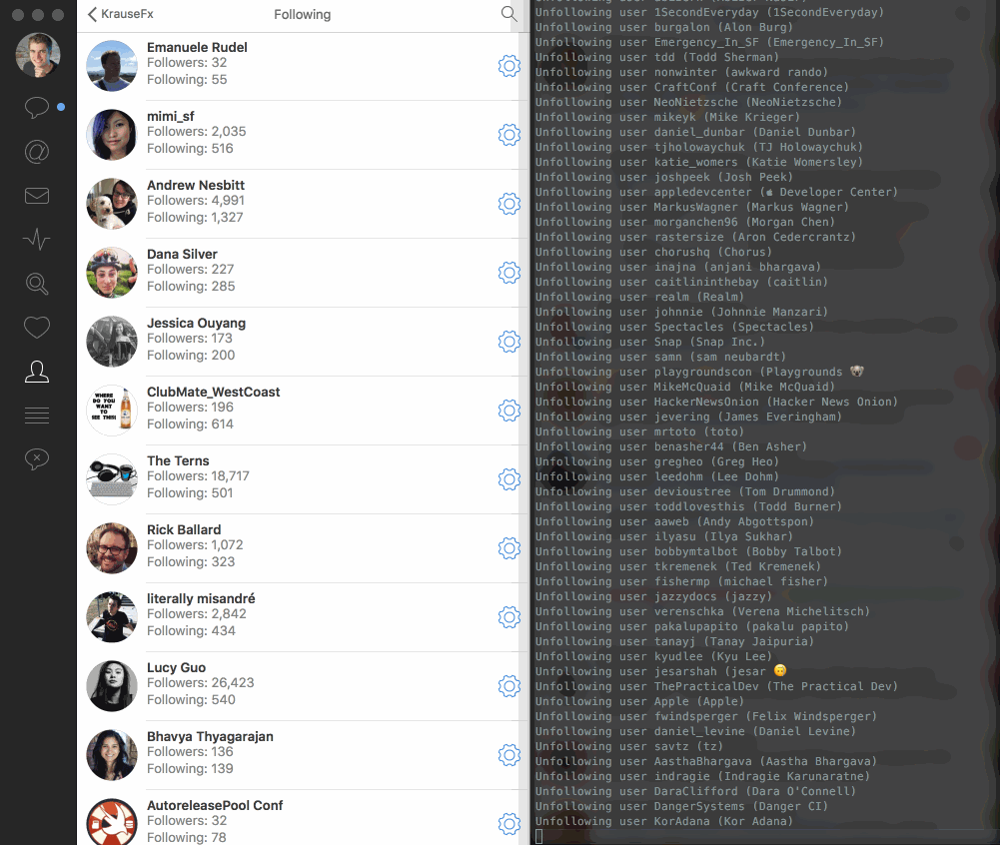

# twitter-unfollow

> My goal for the next months is to spend less time on social media and more time creating. Instead of reacting to things, I want to focus on having a bigger vision, planning things ahead and doing what has the highest impact.
> 
> I've been reading every single tweet in my timeline for the last 4 years with no interruption.
> 
> In total I have over 100 custom mute filters, including custom regexes like `(@United|delta|Delta|JetBlue|jetblue)`), and muted clients like Buffer
>
> It's time for me to stop reading so much on social media portals, and focus on reading books instead.
> 
> I'll still follow a small amount of people via Twitter lists, since there are certain things I really don't want to miss



[View full blog post on my Twitter setup](https://krausefx.com/blog/how-i-use-twitter)

This script does the following:

- Unfollow everybody
- Puts them into a list called "Old Follows"
- Store the usernames of everyone in `unfollowed_usernames.txt` (this allows you to pretty easily follow everyone again when you feel like it)
- Store the usernames, together with full name and bio into `unfollowed_full_names.txt` (this allows you to search for users)

```
bundle update
bundle exec ruby unfollow.rb
```

## Notes:
- Make sure to have DMs open to still be able to chat with your friends.
- Use a list to follow a small subset of people. This way you follow 0 people and nobody feels left out. The list can be private.
- Make sure to create a list called "Old Follows"

## Technical Notes
- Create your application via [Twitter Apps](https://apps.twitter.com)
- Set the following environment variables
  - `ENV["CONSUMER_KEY"]`
  - `ENV["CONSUMER_SECRET"]`
  - `ENV["ACCESS_TOKEN"]`
  - `ENV["ACCESS_TOKEN_SECRET"]`
- Due to the API limits this script can only unfollow about 420 people per run. You'll need to regenerate keys after this 🤷‍♀️

[View full blog post on my Twitter setup](https://krausefx.com/blog/how-i-use-twitter)
